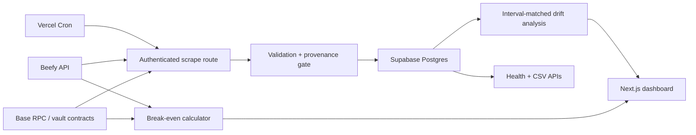

# Yield/Fidelity

[](https://github.com/RahilBhavan/beefy-yield-fidelity-monitor/actions/workflows/ci.yml)

An independent DeFi observability dashboard that compares Beefy vault headline yield with realized on-chain price-per-share (PPS) growth on Base. It also estimates how long a deposit needs to overcome entry and exit costs, making gas and strategy drift visible before they become surprises.

> Independent portfolio project by [Rahil Bhavan](https://github.com/RahilBhavan). Not affiliated with or endorsed by Beefy.

**[Live dashboard](https://yield.rahilbhavan.com/dashboard)** · **[Complete project guide](docs/PROJECT_GUIDE.md)** · **[Project case study](docs/CASE_STUDY.md)** · **[Methodology](https://yield.rahilbhavan.com/methodology)**

## Why it matters

Yield interfaces usually emphasize a current APY. That number does not tell a user whether transaction costs overwhelm a small position or whether a vault has actually compounded at the advertised rate. Yield/Fidelity turns those questions into two inspectable outputs:

- **Break-even horizon:** estimated days for effective daily yield to recover Base entry and exit costs.
- **Strategy drift:** realized PPS growth versus the APY recorded during each measurement interval.

The management summary converts those outputs into analysis coverage, capital reviewed, portfolio-weighted performance, an annualized yield-gap estimate, and an evidence-aware recommended action.

The project deliberately separates planning estimates from observed facts. Gas results disclose their assumptions; drift results are withheld until the data passes a minimum validity window.

## Engineering highlights

- Reads vault PPS directly from Base contracts with Ethers v6 and records block, contract, provider, raw value, decimals, TVL, and scrape-run provenance.
- Compounds expected growth using the APY stored with each observation instead of applying today's APY retroactively.
- Rejects invalid observations and requires at least three valid samples spanning seven days before publishing drift.
- Uses idempotent, authenticated cron ingestion backed by PostgreSQL constraints and row-level security.
- Exposes operational health and reproducible CSV export endpoints alongside the dashboard.
- Includes unit, integration, database, browser, accessibility, and load-smoke verification commands; CI runs the deterministic unit, database, browser, accessibility, build, and dependency checks.

## Architecture



| Layer | Technology | Responsibility |
| --- | --- | --- |
| Web | Next.js 16, React 19, Tailwind CSS 4 | Server-rendered dashboard and interactive calculator |
| Chain | Ethers v6, Base RPC | PPS reads, block provenance, and gas context |
| Data | Supabase PostgreSQL | Vault state, immutable history, scrape runs, and RLS |
| Operations | Vercel Cron, GitHub Actions | Daily ingestion, health monitoring, and verification |
| Quality | Vitest, Playwright, axe-core, SQL tests | Logic, routes, accessibility, migrations, and invariants |

## Correctness model

For consecutive valid PPS observations, the monitor accumulates realized return in log space:

```text
realized log return += ln(current PPS / previous PPS)
expected log return += ln(1 + observed APY) × interval days / 365
relative drift = (realized return − expected return) / expected return
```

The expected APY comes from the earlier observation in each interval. A result is shown only after three valid observations span at least seven days. See the live [methodology page](https://yield.rahilbhavan.com/methodology) for assumptions and limitations.

## Run locally

Requirements: Node.js 20+ and a Supabase project for persistent monitoring data.

```bash
git clone https://github.com/RahilBhavan/beefy-yield-fidelity-monitor.git
cd beefy-yield-fidelity-monitor
npm ci
cp .env.example .env.local
npm run dev
```

Open [http://localhost:3000](http://localhost:3000). The calculator can use live public data without Supabase; the dashboard reports an explicit unconfigured state until read credentials and migrations are present.

Apply the files in `supabase/migrations/` in order, then invoke the authenticated scraper to collect the first observation:

```bash
curl -H "Authorization: Bearer $CRON_SECRET" http://localhost:3000/api/cron/scrape
```

`BASE_RPC_URLS` is optional. The application retains the public Base RPC as a fallback. Never expose the Supabase service-role key to browser code.

## Verification

```bash
npm run check             # lint, unit/route tests, production build
npm run test:integration  # live Supabase/RPC contract integration (opt-in)
npm run test:e2e          # Chromium flows + WCAG A/AA checks
npm run test:load         # health/data/export smoke load
```

CI also applies every migration to PostgreSQL 16, runs database invariants, audits production dependencies, and executes browser tests. The live integration suite is intentionally opt-in because it requires external credentials and network access.

## Operational surface

| Route | Purpose |
| --- | --- |
| `/` | Friction-adjusted break-even calculator |
| `/dashboard` | Coverage, freshness, and PPS drift |
| `/dashboard/strategies` | Vaults more than 5% below interval-matched target |
| `/methodology` | Formulas, provenance, and limitations |
| `/api/health` | Deployment and data-freshness health |
| `/api/export` | Reproducible observation export |
| `/api/cron/scrape` | Authenticated, idempotent daily ingestion |

Release checks, freshness objectives, rollback steps, and incident response live in [docs/OPERATIONS.md](docs/OPERATIONS.md). The threat model and secret boundaries are documented in [docs/SECURITY.md](docs/SECURITY.md).

## Current scope

The current MVP monitors active Beefy vaults on Base. Multi-chain coverage, wallet-specific transaction simulation in the UI, token-price risk, impermanent loss, slippage, bridge costs, taxes, and future APY prediction are outside the present scope. Results are informational and are not financial advice.

The production collector began accumulating the current evidence window in August 2026. Until at least three valid observations span seven days, the dashboard intentionally reports that analysis is in progress instead of publishing a strategy conclusion.

Released under the [MIT License](LICENSE). Yield/Fidelity is an independent project and is not affiliated with or endorsed by Beefy; downstream use remains responsible for applicable third-party names, marks, and data terms.
