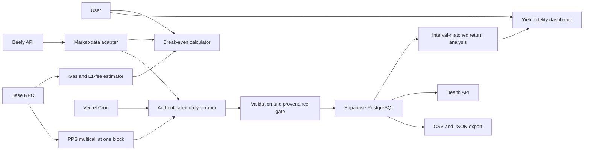

# Yield/Fidelity: Complete Project Guide

This document explains what Yield/Fidelity does, why it exists, how data moves through the system, how the financial analysis works, and how the project is operated and verified.

Yield/Fidelity is an independent portfolio project. It is not affiliated with or endorsed by Beefy, and its outputs are informational rather than financial advice.

## 1. Project overview

Yield/Fidelity is a production financial-analysis application for active Beefy vaults on Base. It answers two questions that a headline APY alone cannot answer:

1. How long should a deposit take to recover its estimated entry and exit costs?
2. Is a vault's realized on-chain price-per-share growth keeping pace with the yield reported during the same period?

The application combines Beefy market data, Base smart-contract reads, transaction-cost estimates, PostgreSQL history, evidence-quality controls, and an analyst-oriented dashboard. The current scope is the 50 largest active Beefy vaults on Base by TVL.

The system has two primary user experiences:

- **Break-even calculator:** estimates daily earnings, transaction friction, and time to recover fees for a selected deposit and vault.
- **Yield-fidelity monitor:** compares interval-matched expected return with realized vault price-per-share growth after the evidence passes a minimum validity window.

Live application: [yield.rahilbhavan.com](https://yield.rahilbhavan.com)

## 2. Business problem

A current APY is useful market context, but it is not a complete decision metric:

- A small position may earn too little per day to recover transaction costs quickly.
- Deposit and withdrawal costs vary with network conditions and ETH price.
- Vault APY can change throughout a measurement period.
- Applying today's APY retroactively can create a misleading historical comparison.
- An attractive dashboard can imply certainty before enough evidence exists.

Yield/Fidelity addresses those risks by separating planning estimates from observed performance. Gas results disclose their assumptions, while strategy-drift results remain unavailable until the observation history passes explicit controls.

## 3. System architecture



| Layer | Technology | Responsibility |
| --- | --- | --- |
| Web | Next.js 16, React 19, TypeScript, Tailwind CSS 4 | Server-rendered pages and interactive analysis tools |
| Market data | Beefy public APIs | Vault metadata, APY, TVL, performance fees, and ETH price |
| Blockchain | Ethers v6, Base JSON-RPC, Multicall | PPS reads, block provenance, gas price, and L1 fee context |
| Data | Supabase PostgreSQL | Vault state, PPS history, scrape runs, failures, constraints, and RLS |
| Operations | Vercel and Vercel Cron | Hosting and scheduled daily ingestion |
| Verification | GitHub Actions, Vitest, Playwright, axe-core, PostgreSQL tests | Logic, builds, routes, accessibility, schema invariants, and dependency checks |

## 4. Break-even calculator

The homepage is a planning tool. A user enters a proposed deposit, searches for a vault, and receives an estimate of how many days of expected earnings would be required to recover entry and exit costs.

### User flow

1. The browser requests `/api/data`.
2. The API loads the active Base vault set, current APYs, TVLs, and ETH price from Beefy.
3. The API obtains a current Base gas and L1 data-fee estimate.
4. The user chooses a vault and deposit amount.
5. The browser calculates expected daily earnings and the break-even horizon.
6. The interface displays downside, current, and upside scenarios.

### Calculation

The effective daily rate implied by an APY is:

```text
daily rate = (1 + APY)^(1 / 365) - 1
```

The remaining calculations are:

```text
daily earnings = deposit × daily rate
total estimated fees = deposit fee + withdrawal fee
break-even days = ceiling(total estimated fees / daily earnings)
```

If expected daily earnings are zero, the application reports that no break-even point can be projected.

### Sensitivity scenarios

| Scenario | APY assumption | Cost assumption |
| --- | ---: | ---: |
| Downside | 75% of current APY | 150% of current estimated costs |
| Current | Current APY | Current estimated costs |
| Upside | 125% of current APY | 75% of current estimated costs |

The scenarios communicate sensitivity rather than treating one network snapshot and one APY as a guaranteed outcome.

### Gas model

The planning estimate includes both Base execution gas and the Ethereum L1 data-posting fee. It uses:

- the current Base gas price;
- L1 fee upper bounds returned by Base's gas oracle;
- the current ETH/USD price;
- a representative 500,000-gas deposit;
- a representative 500,000-gas withdrawal; and
- representative deposit and withdrawal transaction sizes.

These assumptions are shown in the interface. They are not a wallet-specific quote.

The optional `/api/gas-estimate` route can estimate a prepared transaction. It validates the sender, calldata, value, and target; accepts only active tracked Beefy vault addresses; and never signs or submits a transaction.

## 5. Market-data selection

The market-data adapter requests Beefy's vault, APY-breakdown, TVL, and price endpoints in parallel. It then:

1. validates the response shapes;
2. keeps vaults whose chain is `base` and status is `active`;
3. requires an earn-contract address;
4. normalizes TVL, total APY, performance fee, and token metadata;
5. sorts the results by TVL; and
6. selects the largest 50 vaults.

Transient upstream requests are retried up to three times with timeouts and short backoff. Calculator market data is cached briefly; the daily scraper requests fresh data so the APY and TVL stored with an observation represent that run.

## 6. On-chain PPS collection

Price per share, or PPS, represents the amount of underlying vault value associated with one vault share. If a vault compounds successfully, its PPS should generally increase.

For each tracked vault, the collector needs:

- `getPricePerFullShare()`; and
- `decimals()`.

The collector batches both calls for all vaults through Base's Multicall contract. Every call in a batch is evaluated at the same block, which avoids mixing observations from different chain states.

For every valid result, the collector records:

- vault and contract identifiers;
- normalized PPS;
- raw integer PPS;
- decimal precision;
- Base block number and hash; and
- RPC provider label.

A reverted call or undecodable response becomes a recorded scrape failure. It is not silently converted into a zero or included in performance analysis.

## 7. Daily ingestion lifecycle

Vercel Cron calls the protected `/api/cron/scrape` route with a bearer token.

```text
GET /api/cron/scrape
Authorization: Bearer <CRON_SECRET>
```

The route performs the following lifecycle:

1. Fail closed if `CRON_SECRET` is absent or the bearer token does not match.
2. Claim the scrape run for Base and the current UTC date.
3. Return the existing status without duplicate work if that daily run already completed.
4. Allow a failed run, or a run stuck for more than one hour, to be reclaimed.
5. load fresh Beefy market data;
6. read all possible PPS values at one Base block;
7. reject missing, non-positive, unmatched, reverted, or undecodable observations;
8. atomically update vault state, valid snapshots, recorded failures, and run status in PostgreSQL; and
9. preserve an error message and failed status if processing fails.

The `(chain, run_date)` scrape-run constraint and `(vault_id, snapshot_date)` PPS constraint make daily ingestion idempotent.

## 8. Database model

### `vaults`

Stores current portfolio metadata:

- vault ID and name;
- chain and earn-contract address;
- current target APY and TVL;
- active status;
- last-seen timestamp; and
- creation and update timestamps.

### `pps_history`

Stores the analytical observation history:

- vault ID;
- UTC snapshot date and timestamp;
- normalized and raw PPS;
- PPS decimals;
- APY and TVL observed with that snapshot;
- chain ID and contract address;
- block number and hash;
- provider label;
- scrape-run ID; and
- validation status and error.

### `scrape_runs`

Stores operational provenance for each daily attempt:

- chain and date;
- running, completed, or failed status;
- start and completion time;
- requested, recorded, and skipped counts;
- block and provider provenance; and
- error message.

### `scrape_failures`

Stores vault-specific collection failures with the contract, run, and reason. Preserving failures makes incomplete coverage explainable and auditable.

Row-level security permits public reads of public protocol telemetry while write operations use server-only credentials.

## 9. Yield-fidelity methodology

The monitor compares the return implied by the APY recorded during each interval with the return observed through PPS over the same interval.

### Why the comparison is interval matched

Using today's APY for an entire historical window would imply that the current rate existed in the past. Instead, each interval uses the APY recorded at the earlier observation.

For consecutive valid observations:

```text
expected interval log return
    = ln(1 + earlier observed APY) × interval days / 365

realized interval log return
    = ln(current PPS / previous PPS)
```

The system accumulates both quantities in log space because log returns combine consistently across intervals:

```text
cumulative expected return = exp(sum of expected log returns) - 1
cumulative realized return = exp(sum of realized log returns) - 1
```

Relative drift is:

```text
relative drift
    = (realized return - expected return) / expected return
```

A drift of `-5%` means the cumulative realized return is 5% below the cumulative expected return for the measured period. It does not mean that the position lost 5% of its capital.

### Evidence gate

The application publishes a vault analysis only when:

- at least three observations are valid;
- those observations span at least seven days;
- consecutive PPS values are positive;
- the earlier interval APY is finite and greater than `-100%`;
- elapsed interval time is positive; and
- cumulative expected return is positive and mathematically valid.

Until these requirements pass, the dashboard shows collection progress rather than a strategy conclusion.

### Annualization and confidence

Expected and realized APY are annualized from the accumulated log returns for portfolio comparison. Short windows can produce volatile annualized values, so confidence is disclosed:

| Confidence | Minimum history |
| --- | --- |
| Low | Valid initial seven-day analysis window |
| Medium | At least 14 days and seven observations |
| High | At least 30 days and 20 observations |

## 10. Portfolio analysis

Once one or more vaults pass the evidence gate, the dashboard calculates:

- **Analysis coverage:** analyzed vaults divided by active tracked vaults.
- **Latest snapshot coverage:** active vaults represented in the latest UTC snapshot date.
- **Analyzed TVL:** TVL associated with vaults that pass the evidence gate.
- **TVL-weighted expected APY:** `Σ(TVL × expected APY) / analyzed TVL`.
- **TVL-weighted realized APY:** `Σ(TVL × realized APY) / analyzed TVL`.
- **Underperforming TVL:** TVL associated with exceptions.
- **Annualized yield-gap estimate:** `Σ TVL × (expected APY - realized APY)`.

The annualized yield gap is an extrapolated prioritization metric. It is not a forecast, realized loss, or promise of future performance.

A vault enters exception review when relative drift is at or below `-5%`. Exceptions are sorted from the largest relative shortfall upward.

## 11. Dashboard experience

The dashboard is organized as an analyst decision surface rather than a collection of disconnected charts.

### Portfolio and quality metrics

- active vault count;
- tracked TVL;
- TVL-weighted current APY;
- latest snapshot coverage;
- analysis coverage; and
- data freshness against the 36-hour objective.

### Management insight

The dashboard changes its conclusion and recommendation with the evidence state:

| Evidence state | Conclusion and action |
| --- | --- |
| Unavailable | Restore database or ingestion health before drawing conclusions. |
| Collecting | Continue daily collection and verify coverage. |
| Ready, no exceptions | Continue monitoring; the threshold does not support intervention. |
| Ready, exceptions present | Validate the most material variance and its provenance before escalation. |

### Evidence readiness

Before analysis is ready, the dashboard shows:

- observation-day count;
- measurement-window duration;
- earliest eligible date;
- latest valid snapshot coverage; and
- completion state for the initial snapshot, minimum observations, measurement window, and portfolio analysis controls.

### Performance visualization

After the gate passes, the dashboard displays cumulative expected and realized returns for the highest-TVL analyzed vault. The chart includes 7, 14, 30, and 90-day controls, a shaded variance region, point descriptions, and an accessible data table.

### Portfolio workspace

Every active vault remains visible while the historical analysis matures. Users can search, filter, and sort by TVL, current APY, observations, or drift. Each vault shows PPS, freshness, status, and a link to the corresponding Base block. Desktop uses a dense table; mobile uses compact analytical cards.

### Exception workspace

`/dashboard/strategies` shows only vaults that breach the `-5%` review threshold after passing the evidence gate. It includes expected and realized APY, drift, TVL, estimated annualized gap, observation depth, window length, confidence, and block provenance.

## 12. API surface

| Route | Method | Purpose |
| --- | --- | --- |
| `/api/data` | GET | Current vault, APY, TVL, ETH-price, and planning gas data |
| `/api/gas-estimate` | POST | Validate and estimate a prepared transaction for a tracked vault |
| `/api/cron/scrape` | GET | Authenticated, idempotent daily PPS ingestion |
| `/api/health` | GET | Chain connectivity, database configuration, and freshness health |
| `/api/export` | GET | Reproducible valid observations as CSV or JSON |

API responses include request identifiers where useful for tracing failures. Public read endpoints use explicit cache policies; transaction simulation is not cached.

The export endpoint accepts:

```text
?format=csv
?format=json
?vaultId=<vault-id>
```

It returns at most 10,000 valid observations and escapes CSV cells safely.

## 13. Health and operations

`/api/health` checks the current Base block and the latest valid database snapshot in parallel. It reports:

- chain slug and ID;
- latest observed Base block;
- configured provider count;
- database configuration state;
- latest snapshot timestamp and block; and
- snapshot age in hours.

Health is degraded when data access is not configured, no valid snapshot exists, or the latest snapshot is more than 36 hours old.

The documented service objectives are:

- at least 99.5% daily scrape completion over 30 days;
- latest valid snapshot less than 36 hours old;
- at least 95% valid snapshot coverage;
- calculator API p95 below 2.5 seconds under the smoke profile; and
- no alert before three valid observations span seven days.

GitHub Actions probes production health every 15 minutes. The operations runbook explains release checks, retry behavior, incident response, and safe rollback.

## 14. Security boundaries

- Supabase service-role credentials are server-only.
- Browser-readable data uses an anonymous Supabase key constrained by RLS.
- The scraper rejects requests unless `CRON_SECRET` is configured and matches.
- No wallet private keys are requested or stored.
- No transaction is signed or submitted.
- Prepared-transaction estimates allow only active tracked vault contracts.
- The database contains public protocol telemetry, not personal or wallet data.
- Application rollback is separated from additive database migration rollback.

The current dashboard is intentionally read-only. Any future strategist action would require authentication, authorization, confirmation, and immutable audit records.

## 15. Verification strategy

### Unit and route tests

Vitest covers yield conversion, break-even calculations, sensitivity scenarios, vault selection, gas calculations, chain adapters, drift methodology, evidence gates, portfolio aggregation, route authentication, duplicate-run handling, and transaction validation.

### Database tests

CI applies every migration to PostgreSQL 16 and checks uniqueness, constraints, scrape-run state, atomic ingestion, provenance, and referential integrity.

### Browser and accessibility tests

Playwright exercises desktop and mobile calculator, dashboard, exception, methodology, health, and export behavior. axe-core checks automated WCAG A and AA rules, while viewport assertions detect horizontal page overflow.

### Build and dependency checks

Every push runs lint, unit tests, a production Next.js build, a production-dependency audit, database verification, and browser tests. Live Supabase/RPC integration and load-smoke suites remain opt-in because they require external credentials or target a running deployment.

Local commands:

```bash
npm run check
npm run test:e2e
npm run test:integration
npm run test:load
```

## 16. Local development

Requirements are Node.js 20+ and, for persistent monitoring, a Supabase project.

```bash
git clone https://github.com/RahilBhavan/beefy-yield-fidelity-monitor.git
cd beefy-yield-fidelity-monitor
npm ci
cp .env.example .env.local
npm run dev
```

The calculator can use public Beefy and Base data without Supabase. The dashboard displays an explicit unconfigured state until read credentials and migrations are available.

Apply every file in `supabase/migrations/` in filename order. The service-role key and cron secret must remain server-only. See `.env.example` for the complete variable list.

## 17. Scope and limitations

The current release monitors active Beefy vaults on Base. It does not model:

- underlying token-price exposure;
- impermanent loss;
- slippage;
- bridge costs;
- taxes;
- protocol exploit risk;
- wallet-specific approval behavior in the main calculator;
- future APY; or
- multi-chain performance.

PPS measures vault-share growth, not the market-price return of the deposited assets. Beefy's APY is an external input, and short observation windows can make annualized results volatile.

The project does not manufacture historical observations. A trustworthy backfill would require both an archival Base RPC and a reliable historical APY source at matching timestamps.

## 18. Repository map

| Path | Responsibility |
| --- | --- |
| `src/components/Calculator.tsx` | Interactive calculator experience |
| `src/components/PortfolioTable.tsx` | Searchable desktop table and mobile vault cards |
| `src/components/DriftChart.tsx` | Expected-versus-realized performance chart |
| `src/lib/yield.ts` | Break-even and scenario formulas |
| `src/lib/beefy.ts` | Beefy API adapter and vault selection |
| `src/lib/baseGas.ts` | Representative Base and L1 fee model |
| `src/lib/transactionGas.ts` | Prepared-transaction estimation |
| `src/lib/pps.ts` | Same-block Base PPS multicall |
| `src/lib/dashboard.ts` | Evidence gating and portfolio analysis |
| `src/app/api/` | Public data, health, export, simulation, and ingestion routes |
| `supabase/migrations/` | PostgreSQL schema and atomic ingestion functions |
| `supabase/tests/` | Database invariants |
| `tests/e2e/` | Browser and accessibility verification |
| `.github/workflows/` | CI and production health monitoring |

## 19. What the project demonstrates

Yield/Fidelity demonstrates the ability to:

- gather and reconcile market, blockchain, database, and operational data;
- manipulate a multi-vault portfolio dataset and identify meaningful exceptions;
- design a controlled expected-versus-realized variance methodology;
- quantify transaction friction and perform sensitivity analysis;
- translate complex evidence into management-level recommendations;
- communicate uncertainty without inventing unsupported conclusions;
- design server-only credential boundaries and read-only public surfaces; and
- ship a monitored, tested, reproducible production workflow.

## 20. Related documentation

- [README](../README.md): project summary, setup, and core commands
- [Case study](CASE_STUDY.md): business framing and decision-support narrative
- [Methodology](https://yield.rahilbhavan.com/methodology): public-facing formulas and limitations
- [Operations runbook](OPERATIONS.md): release, monitoring, incidents, and rollback
- [Security model](SECURITY.md): credentials, data boundaries, and future authorization requirements

